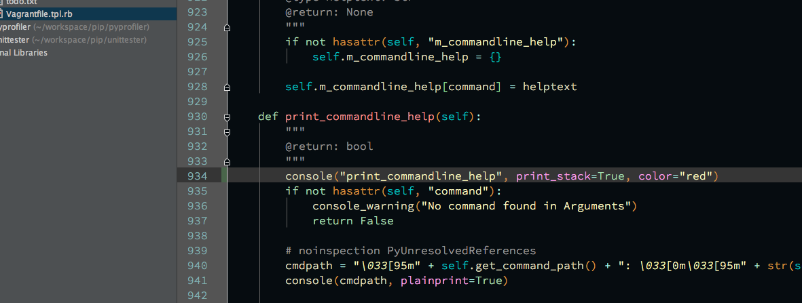

# consoleprinter
Console printer with linenumbers, stacktraces, logging, conversions and coloring.

Active8 BV
Active8 (05-03-15)
license: GNU-GPL2

###example

Add a method call to console somewhere in your code, for example
```python
console(os, print_stack=True, color="red")
```
> 
 
It will give a stacktrace in the terminal

> 

If the printer detects an object it will try to do a dir an give the layout with values

```python

class MyObject(object):
    """
    MyObject
    """
    m_float = 8.0
    m_string = "hello"
    m_int = 8

    @staticmethod
    def foo():
        """
        foo
        """
        pass

    def __str__(self):
        """
        __str__
        """
        return "My Little Object"

mo = MyObject()
console(mo)
```

> 

```bash
0.17 | arguments/__init__.py", line 957 (print_commandline_help) | <arguments.Arguments.print_commandline_help.<locals.MyObject object at 0x1034026d8>: My Little Object
     | MyObject                          type                           value
     | ------------------------------------------------------------------------------------------
     | foo                               function
     | m_float                           float                          8.0
     | m_int                             int                            8
     | m_string                          str                            hello


```
##install
```bash
pip install consoleprinter
```

##contains
Utility functions for working with commandline applications.
Logging
Printing
Exception parsing
Stacktracing
Object reflection printing

##usage
```python
from consoleprinter import console

colors = ['black', 'blue', 'cyan', 'default', 'green', 'grey', 'magenta', 'orange', 'red', 'white', 'yellow']

for color in colors:
    console(color, color=color)
```

## PyCharm
Console detects when run in PyCharm or Intellij, and adds links to the orinating line
```python
    if len(suite._tests) == 0:
        console_warning("Can't find tests, looked in test*.py")

```
```bash
2.48 | unittester.py:85 | == | Can't find tests, looked in test*.py | File "/Users/rabshakeh/workspace/unittester/unittester/unittester.py", line 85 (run_unit_test) | ==
``

##Reflection
```python
with zipfile.ZipFile(zippath) as zf:
    for member in zf.infolist():
        console(member)
```
> 